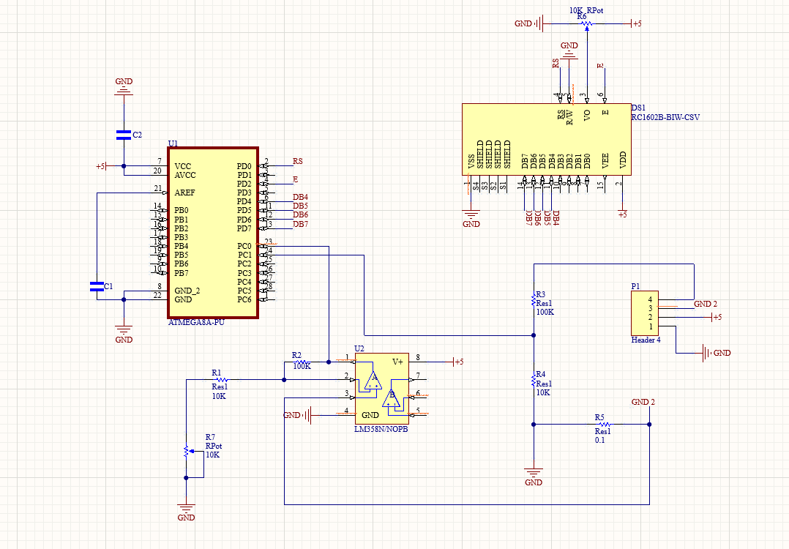

# Digital Volt-Ammeter Project


## Overview
This project demonstrates a basic digital voltmeter and ammeter using an ATmega8 microcontroller, LCD display (1602), voltage divider, current shunt, and an operational amplifier. It can accurately measure voltage in the range of 0 to 25 volts and current from 0 to 2.5 amperes. The measurements are displayed on the LCD.

## Components
- ATmega8 microcontroller
- LCD display 1602
- Voltage divider (100 kΩ and 10 kΩ resistors)
- Current shunt (0.1 Ω)
- Operational amplifier (op-amp) [LM358]

## Schematic
<p align="center">
  
</p>

## Voltage Measurement

Voltage measurement is done using a voltage divider, which is made up of two resistors: 100 kΩ and 10 kΩ. This divider reduces the voltage so it can be safely measured. The maximum input voltage that can be applied to the voltage divider is 55V, and the formula for calculating the measured voltage is:

```
U = ADC * Uref * K / 1024
```

Where:
- U is the result in Volts
- ADC is the result of the analog-to-digital conversion
- Uref is the reference voltage (2.56V)
- K is the voltage divider coefficient (11 for this setup)
- 1024 is the 10-bit ADC bit width.

## Current Measurement

To measure current, a current shunt is used, which creates a small voltage drop proportional to the current. In this setup, the voltage drop is 0.1 V for 1 A and 0.2 V for 2 A. An op-amp is used to amplify this voltage for precise measurement. The op-amp is configured as a non-inverting amplifier with a gain of 10. The formula for calculating the measured current is:

```
I = ADC * Uref * K / 1024
```

Where:
- I is the result in Amperes
- ADC is the result of the analog-to-digital conversion
- Uref is the reference voltage (2.56V)
- K is the gain of the op-amp (10 for this setup)
- 1024 is the 10-bit ADC bit width.

## Program
The microcontroller's program continuously takes measurements, calculates average values from 250 samples, and displays the results on the LCD. The code is written in C, providing a beginner-friendly introduction to digital measurement.

[**View Source Code (main.c)**](main.c)

## Uploading the Program

1. **Connect the Programmer:**
   - Connect your AVR programmer (e.g., USBASP, AVRISP, etc.) to the ATmega8 microcontroller.
   - Make sure the programmer is correctly connected to your computer.

2. **Open the Project:**
   - Open the project folder in your AVR Studio.

3. **Compile the C Code:**
   - In AVR Studio, locate the `main.c` file in the project folder.
   - Compile the C code to generate the HEX file.

4. **Program the ATmega8:**
   - Use your programmer software to upload the HEX file to the ATmega8 microcontroller.
---
Now, your digital voltmeter and ammeter project is ready to measure voltage and current accurately and display the results on the LCD display.

## License
This project is licensed under the MIT License. See the [LICENSE](LICENSE) file for details.
